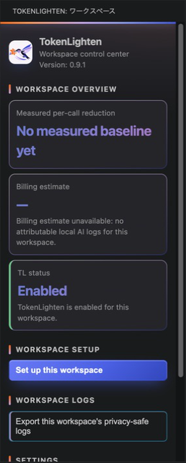

<picture>
  <source media="(prefers-color-scheme: dark)" srcset="media/brand/github-header-dark.png">
  <source media="(prefers-color-scheme: light)" srcset="media/brand/github-header-light.png">
  
</picture>

# TokenLighten

<p align="center"><strong>リポジトリ全体ではなく、エージェントが必要とする正確なコンテキストを。</strong></p>

[English](README.md) | [日本語](README.ja.md)

**TokenLighten**は、ファイル全体を繰り返し送る代わりに、コーディングエージェントへ対象を絞ったリポジトリコンテキストを提供する、ローカルファーストのMCPツールキットです。

公開するツールは`read_file`、`search_files`、`edit_file`の3つです。

## v0.9.1 Public Beta

TokenLighten v0.9.1は初期の公開版です。フィードバックを反映する過程で、インターフェースや対応ワークフローが変更される場合があります。重要な作業はバックアップを取り、公開Issueには非公開のソースコード、認証情報、顧客データを含めないでください。

このリリースには以下が含まれます。

- TokenLighten CLIとMCPサーバー
- 開発者向けのソースコードとパッケージテスト
- 単体で動作するVSIX形式のVS Code拡張機能

デスクトップアプリケーションはv0.9.1に含まれません。

## 実際の動作



Control Centerでは、セットアップ、ワークスペースの状態、ローカル計測、有効／無効の切り替えを一か所で確認できます。

## TokenLightenを使う理由

コーディングエージェントは、小さな変更を行うまでに、ファイルの探索、広い範囲の読み込み、同じコンテキストの再読込に複数ターンを費やすことがあります。TokenLightenはリポジトリをローカルで探索し、コンパクトな構造、シンボル、正確な範囲、範囲を限定した編集ハンドルを返します。

リポジトリのインデックス作成とコンテキスト選択はローカルCPU上で実行されます。TokenLighten自体がAIモデルを追加したり、リポジトリの内容をアップロードしたりすることはありません。エディタ、MCPクライアント、AIプロバイダーには、それぞれの設定と利用条件が引き続き適用されます。

削減効果は、リポジトリ、タスク、クライアント、モデルの動作によって異なります。TokenLightenが表示する使用量とコストはローカルな推定値であり、プロバイダーの請求記録ではありません。

## トークンとタスクコストの削減効果が期待できる場面

TokenLightenは、複数のファイル、パッケージ、文書形式にまたがって影響箇所を特定し、漏れなく正しく更新する必要があるタスクで、最も大きな効果を発揮するよう設計されています。変更箇所が既知の1か所に限定されるタスクでは、効果が小さくなると考えられます。

シンボル検索と参照検索は、該当する定義や呼び出し箇所を直接返せます。文書リーダーは、スプレッドシートをはじめとする対応形式から、ファイル全体を読み込まずに構造化された内容を抽出できます。これにより、リポジトリや文書を横断する作業に必要なコンテキストを集める際、検索と再読込の繰り返しを減らせます。

### 初期の開発者ベンチマーク結果

複数パッケージを変更するコードタスクでは、共通の列挙型に値を追加し、その変更をフロントエンドコンポーネント、バックエンドの検証処理、カテゴリ別の集計ロジックへ一貫して反映しました。6回の反復ベンチマークでは、TokenLightenを使用した場合、同じエージェントがTokenLightenを使用しなかった場合と比べ、検証に合格したタスクのコストが約**56%**削減されました。

文書を横断する実装タスクでは、スプレッドシートで管理された料率表と、別の文書に記載された計算手順を組み合わせ、両方の情報に整合する新しい料金計算モジュールを実装しました。6回の反復ベンチマークでは、TokenLightenによって検証に合格したタスクのコストが約**48%**削減されました。

初期結果から、効果が出にくい場面も分かっています。

- 単一の大規模なスプレッドシートを単独で分析し、ほかの情報源と組み合わせて新しいコードを作成しないタスクでは、明確な優位性は確認されませんでした。
- 既知の値を既存コードの処理経路へ渡すだけで、リポジトリ全体を広く探索しない小規模な局所変更では、結果にばらつきがありました。このような場合、TokenLightenによるコンテキスト収集のオーバーヘッドが削減効果を上回ることがあります。

これらは開発者が実施した初期ベンチマークの結果であり、削減効果を保証するものではありません。実際のトークン使用量とタスクコストは、リポジトリ、タスク、クライアント、モデルの動作、プロバイダーの料金によって異なります。

## VS Code拡張機能をインストールする（ビルド不要）

一般ユーザーは、v0.9.1 Public BetaのGitHub Releaseから[tokenlighten-vscode-extension-0.9.1.vsix](https://github.com/Takayuki-Ishimaru/tokenlighten/releases/download/v0.9.1/tokenlighten-vscode-extension-0.9.1.vsix)をダウンロードしてください。Node.jsの導入やソースからのビルドは不要です。このリリースにはOS固有のネイティブバイナリが含まれないため、Windows、macOS、Linuxで同じVSIXを使用します。

インストール手順は次のとおりです。

1. VS Codeで**拡張機能**ビューを開きます。
2. **VSIXからのインストール…**を選びます。
3. ダウンロードしたファイルを選択します。

ターミナルからインストールすることもできます。

```sh
code --install-extension tokenlighten-vscode-extension-0.9.1.vsix
```

信頼済みのプロジェクトフォルダを開き、TokenLightenビューから**このワークスペースをセットアップ**を選択します。VSIXにはCLI、MCPサーバー、パーサー、必要なアセットが含まれるため、別途グローバルインストールする必要はありません。

詳しくは[VS Code拡張機能](release-docs/vscode-extension.ja.md)を参照してください。

## 対応クライアント

| クライアント | 自動セットアップ | 手動設定 | v0.9.1での検証 |
|---|---|---|---|
| Codex CLI / VS Code版Codex | Yes | Yes | macOS上のCLI 0.148.0-alpha.9、VS Code拡張機能 26.810.52044 |
| Claude Code / VS Code版Claude Code | Yes | Yes | macOS上のCLI 2.1.211、VS Code拡張機能 2.1.233 |
| VS Code / GitHub Copilot | Yes | Yes | macOS上のVS Code 1.133.0で拡張機能とセットアップをスモークテスト。Copilotのバージョンは未記録 |
| Cursor | Partial：管理対象の指示ファイルのみ | Yes：CursorのMCP設定を使用 | v0.9.1のリリース検証対象外 |

上記のバージョンは、2026-08-16のv0.9.1スモークテストで使用したローカル環境の記録であり、最低対応バージョンを保証するものではありません。自動テストでは、Codex、Claude Code、VS Code、Copilot、Cursor向けの設定／指示ファイル生成も確認しています。CursorへのMCP登録は手動です。

## ソースからビルドする

必要な環境は次のとおりです。

- Node.js 20以降
- npm
- 書き込みを許可したリポジトリ操作を使用する場合はGit

```sh
git clone https://github.com/Takayuki-Ishimaru/tokenlighten.git
cd tokenlighten
npm ci
npm run build
npm link --workspace packages/cli
tl version
tl doctor --json
```

別のワークスペースにTokenLightenをセットアップします。

```sh
cd /path/to/project
tl workspace setup
```

MCPサーバーはデフォルトで読み取り専用です。ワークスペースの変更を明示的に許可する場合だけ、書き込みを有効にしてください。

```sh
tl mcp start --stdio --workspace /path/to/project
tl mcp start --stdio --allow-write --workspace /path/to/project
```

現在のコマンド一覧は`tl help`で確認できます。

## MCPツール

| ツール | 用途 |
|---|---|
| `read_file` | 対象を絞ったファイル内容、構造、シンボル、タスク向けコンテキストパックを返します。 |
| `search_files` | 選択したワークスペース内のファイル、テキスト、シンボル、参照を検索します。 |
| `edit_file` | 事前の読み込みで確立したコンテキストに基づき、範囲を限定して編集します。`--allow-write`が必要です。 |

動作と安全上の注意は[MCPツール](release-docs/mcp-tools.md)を参照してください。

## パッケージ

| パッケージ | 用途 |
|---|---|
| `@tokenlighten/mcp-server` | 標準入出力を使用するMCPサーバーと3つの公開ツールです。 |
| `@tokenlighten/cli` | `tl`コマンドとワークスペース／クライアントのセットアップです。 |
| `@tokenlighten/skeleton-engine` | リポジトリマップ、シンボル、範囲、ルート抽出です。 |
| `@tokenlighten/agents-md` | ドリフト検出機能を備えた、管理対象のエージェント指示ブロックです。 |
| `@tokenlighten/usage` | ローカルな使用量と削減効果の推定です。 |
| `@tokenlighten/types` | 共有する公開TypeScriptコントラクトです。 |
| `tokenlighten-vscode-extension` | 単体で動作するVS Code統合です。 |

## 対応言語とファイル形式

主要なプログラミング言語として、TypeScript、JavaScript、Python、Go、Java、Rust、C、C++、Kotlin、C#、PHP、Rubyに対応しています。

対応するテキスト、Office、PDF、アーカイブ形式も読み取れます。一部の形式は読み取り専用で、PDFにはテキストレイヤーが必要です。現在の対応範囲は[対応言語とファイル形式](release-docs/language-support.md)を参照してください。

## 開発

公開ソースの開発者向けチェックは、リポジトリのルートで実行します。

```sh
npm ci
npm run build
npm run test:packages
npm run test:bundle-cli
npm run licenses
npm run doctor
```

VSIXをビルドします。

```sh
npm run package -w tokenlighten-vscode-extension
```

変更を送る前に[CONTRIBUTING.md](CONTRIBUTING.md)を確認してください。

v0.9.1では、完全なパッケージテストをUbuntuとmacOSのCIゲートにしています。Windows CIでは、ソースのビルド、同梱CLI、依存関係のライセンスと通知、実行時依存関係の監査、診断を確認します。一部のテストfixtureがまだWindowsへ移植できていないため、完全なパッケージテストはWindowsのリリースゲートではありません。これはWindowsやVSIXのインストールが非対応であることを意味せず、Windows固有のテスト範囲は今後拡充します。

## ドキュメント

- [はじめに](release-docs/getting-started.md)
- [MCPツール](release-docs/mcp-tools.md)
- [VS Code拡張機能](release-docs/vscode-extension.ja.md)
- [対応言語とファイル形式](release-docs/language-support.md)
- [プライバシー、セキュリティ、サポート](release-docs/privacy-security-support.md)
- [ライセンスと利用方針](release-docs/licensing.md)

## セキュリティとサポート

### 依存関係監査のスナップショット

2026-08-16にTokenLighten v0.9.1の依存関係を監査した時点で、`npm audit --omit=dev`は、配布するVS Code拡張機能と通常の実行時に使用される依存関係について、**Critical 0件、High 0件、Moderate 2件**を報告しました。

v0.9.1で開発ツールチェーンを更新した後は、開発用依存関係を含む環境全体でも同じく**Critical 0件、High 0件、Moderate 2件**でした。

2件という表示は、`exceljs`経由の1件の`uuid`アドバイザリを依存パッケージ側でも数えているものです。TokenLightenのスプレッドシート処理は、問題のある`uuid` APIを使用していません。アドバイザリID、到達可能性、すぐ更新できない理由、更新予定は[依存関係のセキュリティ状況（英語）](release-docs/dependency-security.md)を参照してください。これは特定日時点の監査結果であり、脆弱性が存在しないことを保証するものではありません。

サーバーは`--allow-write`を指定しない限り読み取り専用です。脆弱性を報告する前に[SECURITY.md](SECURITY.md)、ベストエフォートのサポート方針については[SUPPORT.md](SUPPORT.md)を確認してください。公開Issueには認証情報、非公開のソースコード、顧客データ、未加工のログを投稿しないでください。

## ライセンス

TokenLightenはソースアベイラブルのソフトウェアであり、OSI承認のオープンソースライセンスではありません。個人利用、勤務先や顧客の業務における個人としての利用、組織内利用、適切な表示を伴う個人的かつ非組織的な再配布は、リリースの利用条件で許可されます。製品／サービスへの組み込み、および組織的または商用の再配布には、Takayuki Ishimaru（GitHub: [@Takayuki-Ishimaru](https://github.com/Takayuki-Ishimaru)）の事前の書面による許可が必要です。

リリースに含まれる`LICENSE`が正式な利用条件です。平易な要約は[ライセンスと利用方針](release-docs/licensing.md)を参照してください。
